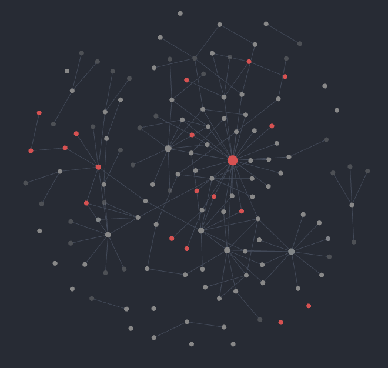

**TL;DR**: Try [Obsidian.md](https://obsidian.md/) — it's great!

---

Over the past few years, I’ve found myself in need of a tool to help me take notes — just to remember things, or to quickly store thoughts in the moment.

When I was younger, I never cared much about where I wrote those notes. I thought just writing them down was enough to remember them.  
*Silly me...*

Eventually, I realized I couldn’t keep everything in my head, so I started searching for a better system.  
And so, the journey began.

---

Like many others, I started with **Evernote**.  
For 3–4 years, it was my go-to:

- A new idea? Write it in Evernote.  
- A line of code I wanted to remember forever? Evernote.  
- A quote that resonated with me? Evernote.

I was writing every day without caring much about organization.  
I added tags when they felt relevant or dropped notes into a notebook if they were part of a project — but nothing fancy.

Over time, though, I started to feel like I was losing control.  
Search helped, sure, but it masked a bigger problem:  
**I always had to search for something.**

I wanted something more *proactive*, more *intelligent*.  
Yeah, I know — those words are a bit overused, but they really do apply here.

---

So I switched.  
And like many others, I moved to **Notion**.

At first, I thought I’d arrived. I could finally *connect everything*!  
Each note had a place, they could be linked, visualized as a table, list, board...  
And then — I got completely lost.

Still, I kept going. I cared for each note, gave them proper tags and metadata.  
Everything had a home. Everything was structured.  
And yet… something was still missing. I didn’t know what.

---

Fast forward a couple more years, and we’re nearly in the present.

Recently, I started reading more “useful” books instead of just fantasy and sci-fi.  
One book in particular changed everything:  
[**How to Take Smart Notes** by Sönke Ahrens](https://amzn.to/3hLKwz9).  
Through it, I discovered the [Zettelkasten](https://en.wikipedia.org/wiki/Zettelkasten) method.

That was the missing piece!  
What I’d needed all along was a way to link my notes and build structure through connections.

---

So... a new journey began.

Now I needed a tool that supported the **Zettelkasten** approach.  
To be fair, Notion could do the job — but not in the way *I* needed.  
I wanted something more minimal. I didn’t want to get buried in features.

---

Then I came across [**Roam Research**](https://roamresearch.com/).  
But $15/month for a note-taking app (without a yearly commitment)? Not happening.

So I kept looking — and found [**Foam**](https://foambubble.github.io/foam/).  
A note-taking toolkit built on **Visual Studio Code**, with GitHub support, my extensions, and a graph view.  
What more could I ask for?

At first, Foam was amazing.  
The graph view was invaluable, and I spent a lot of time linking my notes.  
You never know when a connection could spark a new idea.

But then... I made a mistake: **I organized my notes into folders.**

Foam doesn’t *need* folders — links are enough.  
But I wanted folders anyway.  
That decision led to broken links, duplicated notes, and a small filesystem mess.  
It’s mostly fixed now, but something broke for me.  
Foam tries to do something VSCode wasn’t really built for — and it shows.

---

Aaand I was lost again.

So I had a little talk with my future self:

> “You're not going to buy new games every month and let them rot in your Steam library.  
> You're going to spend $15/month on **Roam**!”

So I jumped in.

This time, I had a clear goal:  
This would be my *Second Brain*.  
I’d feed it so well it would spit out ideas faster than I could handle.  
Note, link, note, link, link everything! *Muahahah!*

But wait... bullet points only?  
How do I write a proper article here?  
Where's the formatting for long-form notes?

Nope. Just bullet points.

I get the appeal — atomic notes, infinite linkability, etc.  
But it’s not what **I’m looking for**.

> “Yes! I have my $15/month back — more games for my *‘I’ll play you soon’* collection!”

---

**Finally**, we reach the end of this journey.

[**Obsidian.md**](https://obsidian.md/) genuinely feels like my *endgame* note-taking system.

It has everything Foam offers — but purpose-built.  
It does what Roam does — but with proper formatting.  
It lacks the clutter of Notion — and that helps me *just write*.

My graph is still small — I haven’t imported everything yet.  
But this is just the beginning. I’ll gradually migrate my notes here and grow my new **Second Brain**.

Oh, and I even started building a plugin for Obsidian:  
[**liquid-templates**](https://github.com/oeN/liquid-template) — it adds support for LiquidJS-style tags in your templates.  
If you're curious, stick around.

---

...You read it all?? 😳  
I’m sorry — I’m all out of potatoes. So instead...

**YOU’RE BREATHTAKING.**
